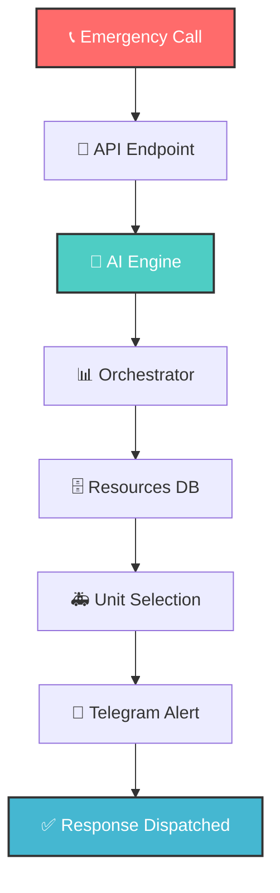

<div align="center">

<!-- Animated Header -->


<br/>

### ⚡ *When Every Second Counts, Intelligence Saves Lives* ⚡

<br/>

<!-- Animated Typing -->
<a href="https://git.io/typing-svg"></a>

<br/><br/>

<!-- Tech Stack Badges -->
<p>


</p>

<!-- Status Badges -->
<p>


</p>

</div>

---

<div align="center">

## 🌐 The Complete ResQ-Desk Ecosystem

</div>

<table align="center">
<tr>
<td align="center" width="50%">

### 🖥️ Frontend Dashboard
  
<a href="https://github.com/sanjayrohith/ResQ-Desk">

</a>

*Visual Command Center*  
*Real-time Maps • Live Tracking • Dispatch Interface*

</td>
<td align="center" width="50%">

### ⚙️ Backend Engine
  


*AI Intelligence Core*  
*NLP Analysis • Smart Routing • Automated Alerts*

</td>
</tr>
</table>

---

<div align="center">

## 👥 Meet The Builders

*The minds behind the mission*

<table>
<tr>
<td align="center" width="33%">
<a href="https://github.com/sanjayrohith">

<br /><br />
<sub><b>🚀 Sanjay Rohith</b></sub>
</a>
<br /><br />
<a href="https://github.com/sanjayrohith">

</a>
</td>
<td align="center" width="33%">
<a href="https://github.com/sanjayy0612">

<br /><br />
<sub><b>💡 Sanjay E</b></sub>
</a>
<br /><br />
<a href="https://github.com/sanjayy0612">

</a>
</td>
<td align="center" width="33%">
<a href="https://github.com/AbishekRaj2007">

<br /><br />
<sub><b>⚡ Abishek Raj</b></sub>
</a>
<br /><br />
<a href="https://github.com/AbishekRaj2007">

</a>
</td>
</tr>
</table>

<br/>

*Built with ❤️ for a safer world*

</div>

---

## 🎯 What is ResQ-Desk?

<table>
<tr>
<td>

> **ResQ-Desk** is an AI-powered emergency response orchestration system that transforms chaotic emergency calls into structured, actionable intelligence — **in seconds, not minutes.**

Imagine a 911 call comes in: *"There's smoke everywhere, I can't see, second floor of the mall!"*

Our AI instantly:
- 🔍 **Analyzes** the transcript using AWS Bedrock
- 🏷️ **Classifies** it as a Fire emergency (Critical severity)
- 📍 **Extracts** the location automatically
- 🚒 **Dispatches** the nearest available fire unit
- 📱 **Alerts** volunteers via Telegram

**All within milliseconds.**

</td>
</tr>
</table>

---

## ✨ Features at a Glance

<div align="center">

```
╔══════════════════════════════════════════════════════════════════╗
║                                                                  ║
║   🗣️  NATURAL LANGUAGE      →    🧠  AI ANALYSIS                 ║
║       "Help! Fire!"               Type: Fire | Severity: High    ║
║                                                                  ║
║   📍  SMART EXTRACTION      →    🚑  AUTO DISPATCH               ║
║       Location detected           Nearest unit assigned          ║
║                                                                  ║
║   📊  CONFIDENCE SCORING    →    📱  INSTANT ALERTS              ║
║       98% certainty               Telegram notifications         ║
║                                                                  ║
╚══════════════════════════════════════════════════════════════════╝
```

</div>

| Feature | What It Does | Why It Matters |
|:-------:|:------------|:---------------|
| 🗣️ **NLP Processing** | Understands natural emergency language | No rigid scripts needed |
| 🔥 **Smart Classification** | Fire, Flood, Medical detection | Right resources, right time |
| ⚠️ **Severity Assessment** | Critical/High/Normal scoring | Prioritize what matters |
| 🚑 **Resource Allocation** | ETA-based unit selection | Fastest response possible |
| 📱 **Telegram Alerts** | Instant volunteer notifications | Everyone stays informed |
| 🎭 **Demo Mode** | Zero-cost presentations | Perfect for showcases |

---


## 🏗️ How It Works

<div align="center">



</div>

### 📦 System Components

```
📞 Emergency Transcript
        │
        ▼
┌─────────────────────────────────────────────────────────────┐
│  🎯 API LAYER                                    main.py    │
│  ┌─────────────────────────────────────────────────────┐   │
│  │  POST /analyze  •  CORS  •  Request Validation      │   │
│  └─────────────────────────────────────────────────────┘   │
└─────────────────────────────────────────────────────────────┘
        │
        ▼
┌─────────────────────────────────────────────────────────────┐
│  🧠 AI ENGINE                                ai_engine.py   │
│  ┌─────────────────────────────────────────────────────┐   │
│  │  AWS Bedrock  •  Prompt Engineering  •  JSON Parse  │   │
│  └─────────────────────────────────────────────────────┘   │
└─────────────────────────────────────────────────────────────┘
        │
        ▼
┌─────────────────────────────────────────────────────────────┐
│  📊 ORCHESTRATOR                          orchestrator.py   │
│  ┌─────────────────────────────────────────────────────┐   │
│  │  Emergency Mapping  •  Unit Selection Algorithm     │   │
│  └─────────────────────────────────────────────────────┘   │
└─────────────────────────────────────────────────────────────┘
        │
        ▼
┌─────────────────────────────────────────────────────────────┐
│  🗄️ RESOURCES                               resources.py    │
│  ┌─────────────────────────────────────────────────────┐   │
│  │  Unit Queries  •  Availability  •  Capability Match │   │
│  └─────────────────────────────────────────────────────┘   │
└─────────────────────────────────────────────────────────────┘
        │
        ▼
┌─────────────────────────────────────────────────────────────┐
│  📱 TELEGRAM NOTIFIER                telegram_notifier.py   │
│  ┌─────────────────────────────────────────────────────┐   │
│  │  Volunteer Alerts  •  Formatted Messages  •  Async  │   │
│  └─────────────────────────────────────────────────────┘   │
└─────────────────────────────────────────────────────────────┘
        │
        ▼
    ✅ Incident Response + Volunteer Alert
```

<details>
<summary>📋 <b>Component Details</b> (Click to expand)</summary>

<br/>

| Component | Responsibility | Key Functions |
|:---------:|:--------------|:--------------|
| `main.py` | 🌐 HTTP Interface | Request handling, CORS, response formatting |
| `ai_engine.py` | 🧠 AI Integration | Bedrock API, prompt engineering, JSON parsing |
| `orchestrator.py` | 📊 Business Logic | Emergency classification, unit matching |
| `resources.py` | 🗄️ Data Layer | Unit queries, availability checks |
| `schemas.py` | 📝 Data Models | Pydantic validation, type safety |
| `telegram_notifier.py` | 📱 Alert System | Volunteer notifications via Telegram |

</details>

---

## 🚀 Quick Start

<div align="center">

*Get up and running in under 2 minutes!*

</div>

### 📋 Prerequisites

<table>
<tr>
<td>✅</td>
<td><b>Python 3.10+</b></td>
<td>Required</td>
</tr>
<tr>
<td>☁️</td>
<td><b>AWS CLI</b></td>
<td>Only for production mode</td>
</tr>
<tr>
<td>📦</td>
<td><b>pip</b></td>
<td>Package manager</td>
</tr>
</table>

### ⚡ Installation

```bash
# 1️⃣ Clone and navigate
git clone https://github.com/sanjayrohith/resq-backend.git
cd resq-backend

# 2️⃣ Create virtual environment
python -m venv venv
source venv/bin/activate  # Windows: venv\Scripts\activate

# 3️⃣ Install dependencies
pip install fastapi uvicorn boto3 pydantic requests
```

### 🏃 Launch the Server

```bash
uvicorn app.main:app --reload
```

<div align="center">

### 🎉 You're Live!

| Endpoint | URL |
|:--------:|:---:|
| 🏠 **Base URL** | `http://localhost:8000` |
| 📖 **API Docs** | `http://localhost:8000/docs` |
| 📋 **OpenAPI** | `http://localhost:8000/openapi.json` |

</div>

---

## 📚 API Reference

### `POST /analyze` — *The Magic Endpoint* ✨

<table>
<tr>
<td width="50%">

**📤 Request**

```json
{
  "text": "There's thick black smoke 
  coming from the second floor 
  of Phoenix Marketcity!"
}
```

</td>
<td width="50%">

**📥 Response**

```json
{
  "incident_id": "RESQ-A3F2",
  "emergency_type": "Fire",
  "severity": "Critical",
  "location": "Phoenix Marketcity, Chennai",
  "reasoning": "Thick black smoke...",
  "confidence_score": 0.98,
  "suggested_unit": "Fire Engine FE12",
  "keywords": ["smoke", "fire"]
}
```

</td>
</tr>
</table>

<details>
<summary>📊 <b>Response Schema Details</b> (Click to expand)</summary>

<br/>

| Field | Type | Description |
|:------|:----:|:------------|
| `incident_id` | `string` | Unique identifier (format: `RESQ-XXXX`) |
| `emergency_type` | `string` | Classification: Fire, Flood, Medical |
| `severity` | `string` | `Critical` \| `High` \| `Normal` |
| `location` | `string` | Auto-extracted from transcript |
| `reasoning` | `string` | AI's analysis rationale |
| `confidence_score` | `float` | Model confidence (`0.0` to `1.0`) |
| `suggested_unit` | `string` | Optimal unit with ETA |
| `keywords` | `array` | Extracted key terms |

</details>

---

## ⚙️ Configuration

<details open>
<summary>🎭 <b>Demo Mode</b> — Perfect for Presentations</summary>

<br/>

> 💡 **Pro Tip:** Demo mode gives you instant, consistent responses without AWS costs!

**Toggle in** `app/ai_engine.py`:
```python
MOCK_MODE = True  # ← Set to False for production
```

| Benefit | Description |
|:-------:|:------------|
| 💰 | Zero AWS costs |
| ⚡ | Instant responses with realistic delays |
| 🎯 | Consistent demo behavior |
| 🔒 | No API rate limits |

</details>

<details>
<summary>🏭 <b>Production Mode</b> — Real AI Power</summary>

<br/>

**Step 1:** Configure AWS credentials
```bash
aws configure
# → Enter AWS Access Key ID
# → Enter AWS Secret Access Key  
# → Default region: us-east-1
```

**Step 2:** Enable Bedrock access in AWS Console  
Ensure `amazon.titan-text-express-v1` model is enabled.

**Step 3:** Disable mock mode
```python
MOCK_MODE = False
```

</details>

<details>
<summary>🗂️ <b>Resource Configuration</b> — Customize Units</summary>

<br/>

Edit `data/units.json`:

```json
{
  "unit_id": "Fire Engine FE12",
  "vehicle_type": "FIRE_ENGINE",
  "distance_km": 2.3,
  "eta_minutes": 4,
  "status": "AVAILABLE"
}
```

**Vehicle Types:** `FIRE_ENGINE` • `AMBULANCE` • `RESCUE_BOAT`  
**Status Values:** `AVAILABLE` • `BUSY`

</details>

<details>
<summary>📲 <b>Telegram Notifications</b> — Alert Volunteers</summary>

<br/>

**Setup Steps:**
1. Create bot via [@BotFather](https://t.me/botfather)
2. Get chat ID from [@userinfobot](https://t.me/userinfobot)
3. Update `app/telegram_notifier.py`:

```python
BOT_TOKEN = "your-bot-token"
VOLUNTEER_CHAT_ID = "your-chat-id"
```

**Sample Alert:**
```
🚨 NEW EMERGENCY ALERT

🔥 Type: Fire
⚠️ Severity: Critical
📍 Location: Phoenix Marketcity, Chennai

🧠 Reasoning:
Thick black smoke visible from food court.

🚑 Suggested Unit:
Fire Engine FE12 (4 mins ETA)

— ResQ Dispatch System
```

</details>

---

## 🧪 Try It Out!

### 🖥️ Using cURL

```bash
curl -X POST http://localhost:8000/analyze \
  -H "Content-Type: application/json" \
  -d '{"text": "Two elderly people trapped on second floor with rising water"}'
```

### 🌐 Using Swagger UI

Navigate to **[localhost:8000/docs](http://localhost:8000/docs)** for:

<table>
<tr>
<td>🧪</td><td>Live API testing</td>
</tr>
<tr>
<td>📝</td><td>Request/response examples</td>
</tr>
<tr>
<td>📖</td><td>Auto-generated documentation</td>
</tr>
<tr>
<td>▶️</td><td>Try-it-now functionality</td>
</tr>
</table>

---

## 📁 Project Structure

```
resq-backend/
│
├── 📂 app/
│   ├── 🎯 main.py              # FastAPI routes & entry point
│   ├── 🧠 ai_engine.py         # AWS Bedrock AI integration
│   ├── 📊 orchestrator.py      # Decision engine & unit matching
│   ├── 🗄️ resources.py         # Resource management & queries
│   ├── 📝 schemas.py           # Pydantic models & validation
│   └── 📱 telegram_notifier.py # Telegram bot alerts
│
├── 📂 data/
│   └── 🚑 units.json           # Emergency unit database
│
└── 📄 README.md                # You are here! 👋
```

---

## 🔧 Technical Decisions

<table>
<tr>
<td align="center" width="25%">
<h3>⚡ FastAPI</h3>
<sub>Framework</sub>
</td>
<td>
• Auto OpenAPI docs<br/>
• Pydantic validation<br/>
• Async support<br/>
• Type hints
</td>
</tr>
<tr>
<td align="center">
<h3>🧠 AWS Bedrock</h3>
<sub>AI Engine</sub>
</td>
<td>
• Serverless inference<br/>
• Pay-per-use<br/>
• Enterprise security<br/>
• Multiple models
</td>
</tr>
<tr>
<td align="center">
<h3>🎭 Mock Mode</h3>
<sub>Demo System</sub>
</td>
<td>
• Zero dependencies<br/>
• Realistic delays<br/>
• Consistent data<br/>
• Cost-free demos
</td>
</tr>
</table>

---

## 🚢 Production Deployment

<details>
<summary>📋 <b>Pre-deployment Checklist</b></summary>

```bash
# Generate requirements
pip freeze > requirements.txt

# Security hardening
✅ Restrict CORS origins in main.py
✅ Add API authentication
✅ Enable HTTPS/TLS

# Monitoring setup
✅ Configure CloudWatch logs
✅ Set up error alerting
✅ Add performance metrics

# Configuration
✅ Set MOCK_MODE = False
✅ Use environment variables
✅ Configure production DB
```

</details>

<details>
<summary>🚀 <b>Recommended Enhancements</b></summary>

<br/>

| Enhancement | Purpose |
|:------------|:--------|
| 🗃️ PostgreSQL/DynamoDB | Replace `units.json` |
| ⏱️ Rate Limiting | Use `slowapi` |
| 📊 Request Logging | Add tracing |
| 🔄 CI/CD Pipeline | Automated deploys |
| 📈 Auto-scaling | Handle load spikes |
| ❤️ Health Checks | Uptime monitoring |
| 📱 Multi-channel Telegram | Emergency-specific channels |
| ✅ Volunteer ACK System | Confirm dispatches |
| 📲 SMS Fallback | Critical alerts backup |

</details>

---

## 💻 Development

<details>
<summary>🎨 <b>Code Style</b></summary>

- Type hints throughout
- Pydantic for validation
- Clear separation of concerns
- Minimal dependencies

</details>

<details>
<summary>➕ <b>Adding Emergency Types</b></summary>

1. Update `orchestrator.py` mapping
2. Add vehicle types to `units.json`
3. Update AI prompt in `ai_engine.py`

</details>

<details>
<summary>🧠 <b>Extending AI</b></summary>

Modify prompt in `ai_engine.py`:
```python
def build_prompt(text: str) -> str:
    return f"""Your custom prompt..."""
```

</details>

---

## 📜 License

<div align="center">

**MIT License** — Free for personal and commercial use

</div>

---

## 🙏 Acknowledgments

<div align="center">

*Built with cutting-edge technology for life-saving applications*

<br/>


</div>

---

<div align="center">


<br/>

### 💫 If this project helps you, give it a ⭐!

<br/>

**Made with 💖 by the ResQ-Desk Team**

<br/>

<a href="https://github.com/sanjayrohith/resq-backend/issues">

</a>
<a href="https://github.com/sanjayrohith/resq-backend/issues">

</a>
<a href="https://github.com/sanjayrohith/ResQ-Desk">

</a>

<br/><br/>

*Designed for emergency response systems that need* ***speed, accuracy, and reliability.***

<br/>


</div>
